Trucki2Shelly/Tasmota/MQTT Gateway (T2SG) V1.07
-----------------------------------------------
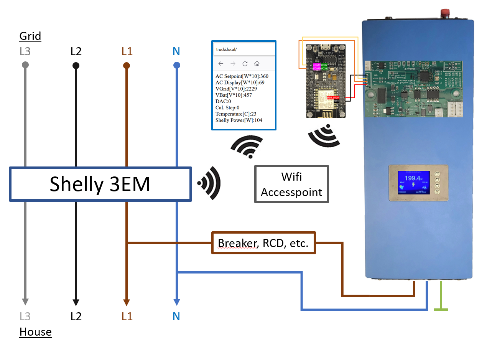
  
The Trucki2Shelly Gateway reads your house power consumption from an engery meter (i.e. Shelly 3EM) and limits the power output of your SUN-GTIL2-1/2000 solar inverter to your actual house consumption.

Besides the energy meter you will need the following components: 
- Trucki's RS485 interface pcb
- WEMOS D1 mini Pro 
- Adapter RS485 interface pcb - WEMOS module

My RS485 inteface pcb converts the analog limiter input of the SUN-GTIL2-1/2000 solar inverter to an RS485 or UART input. More documentation can be found here:
https://github.com/trucki-eu/RS485-Interface-for-Sun-GTIL2-1000

If you want to buy my interface and the wemos adapter you can write my an email: RS485(a)trucki(point)eu

The T2SG filters the received total power of the engery meter (ZeroExportController) before it is send to the inverter. The goal of the ZeroExportController (ZEPC) is to keep the total power at ~50W (target min/max). The inverter power rises slowly over ~30s (average*interval) and drops fast (~1s). 

Installation
-------------

Please follow the documentation of the RS485 interface to install it in your inverter:

https://github.com/trucki-eu/RS485-Interface-for-Sun-GTIL2-1000#rs485-modbus-interface-for-sun-gtil2-10002000-mppt-inverter

Make sure J1-J5 (ID:1) are open and the switch (J5) is shifted to UART. If you have a 2000W inverter close the 2000W Jumper on the RS485 interface.

Flashing WEMOS D1 mini pro
--------------------------
Before installing the WEMOS D1 mini pro you should flash the latest *.bin file to it:

https://github.com/trucki-eu/Trucki2Shelly-Gateway/blob/main/bin/

 I use "ESP.Easy.Flasher.exe" :
  
https://github.com/Grovkillen/ESP_Easy_Flasher/releases
  
Before starting ESP Easy Flasher you have to copy the bin-file into the /bin folder. After starting select USB Port, bin-file and baudrate = 115200, press flash. After a reset you can begin with the SETUP.
  
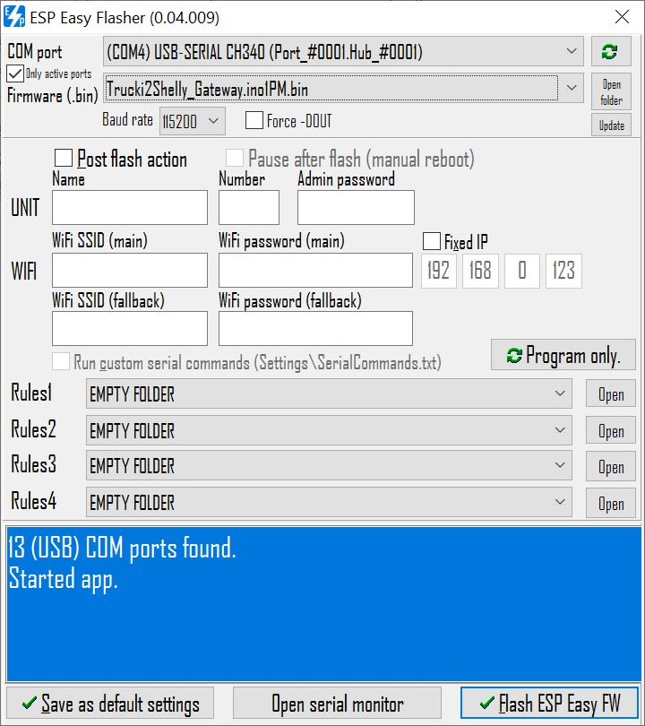

If flashing was successful the blue led on the WEMOS board turns on constant and you will find a wifi accesspoint named: T2SGxxxxxx . 

Now you can proceed directly with SETUP or first install the WEMOS board with the WEMOS adapter into your inverter.

WEMOS Adapter
-------------

The lastest revision (V.31.01.2023) of the RS485 pcb has an onboard WEMOS socket. The WEMOS D1 mini pro can be mounted without an adapter on the RS485 pcb. Make sure to set switch J5 to UART. The WEMOS socket includes a 22uF capacitor on the +3.3V Pin to GND. There is no need for an extra capacitor on the WEMOS board anymore. If your WEMOS D1 mini pro board has a diode between +5V and VUSB you still should bridge it to connect VUSB direct to +5V.

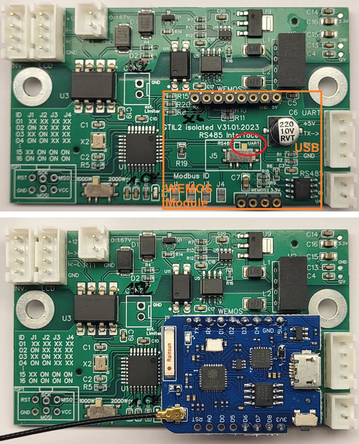

For older RS485 pbc versions there is an adapter (WEMOS not included) to mount a WEMOS D1 mini pro with external antenna into your SUN GTIL2 1/2000 inverter:
  


  
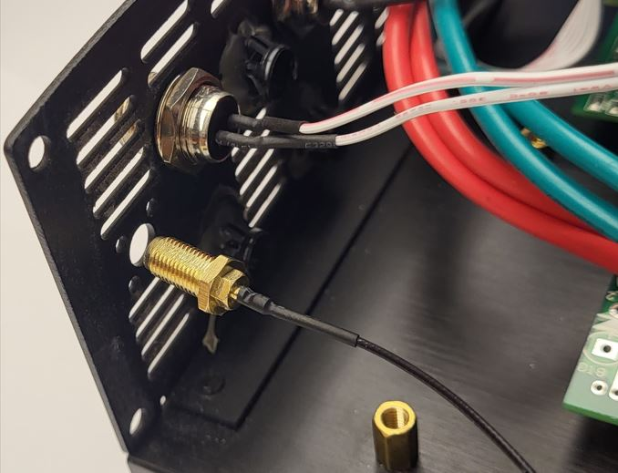  
   
I had some WEMOS D1 mini Pro modules crashing during boot or normal operation. I discoverd voltage drops on the internal 3.3V line of the WEMOS Pro modules:

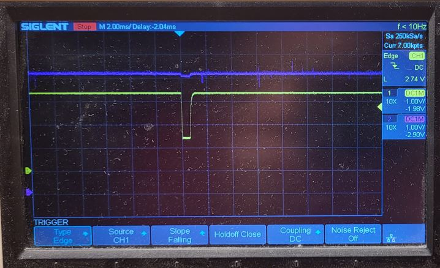

Adding a 10uF capacitor between 3.3V and GND helped:

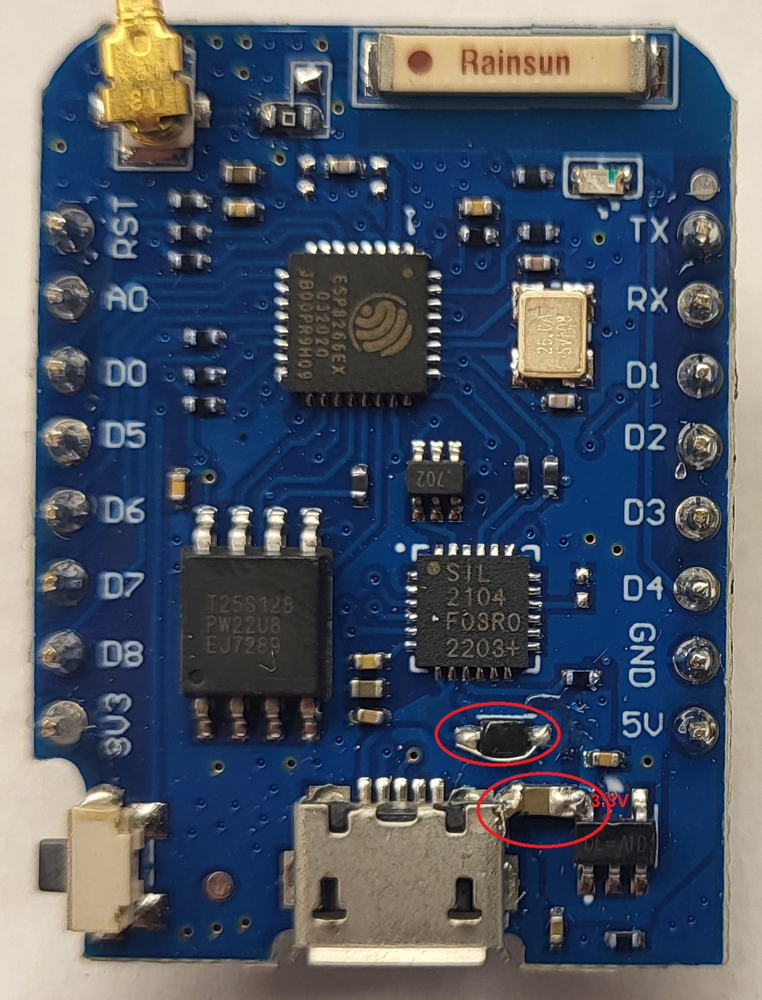

There are versions of the WEMOS D1 mini Pro which have a diode between VCC_USB and +5V. If your WEMOS only works with USB Power you might want to bridge this diode. The other versions are using a fuse instead of the diode. 


Setup
-----
After the first start (~30s) you will find an open accesspoint named:"T2SGxxxxxx".

Connect to it and open http://192.168.4.1 in your browser:

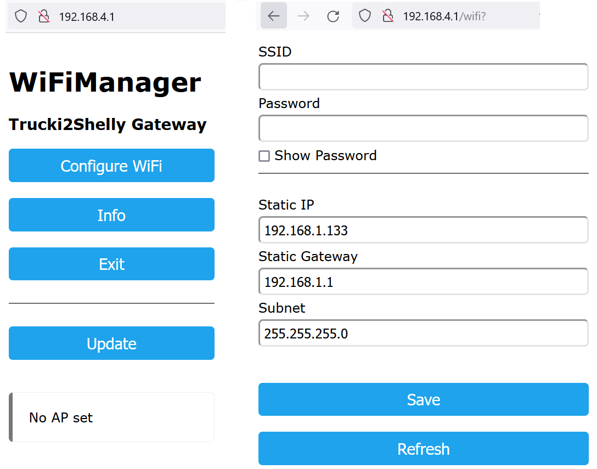

Select Configure Wifi and set your wifi credentials, static IP, Subnet,Gateway address for this ESP8266 Wemos module. DHCP is not supported.

Further settings will be done in the T2SG webinterface once the WEMOS module is successfully connected to your wifi network.
  
Once you have finished you can reset the module and check if it connects to your wifi by observing the blue led, ping the IP address or opening the IP address in your browser.

Blue LED
---------
The blue LED on the WEMOS board flashes every ~1s if connected to your wifi. If the WEMOS module is not configured (Accesspoint "T2SGxxxxxx" is active) the blue LED is constant ON.

Webinterface
------------
Once your WEMOS module is connected to your wifi network you can open the configured IP address in your browser to access a very basic webserver with all values and a link to the settings page. The website will autoreload every 2s.

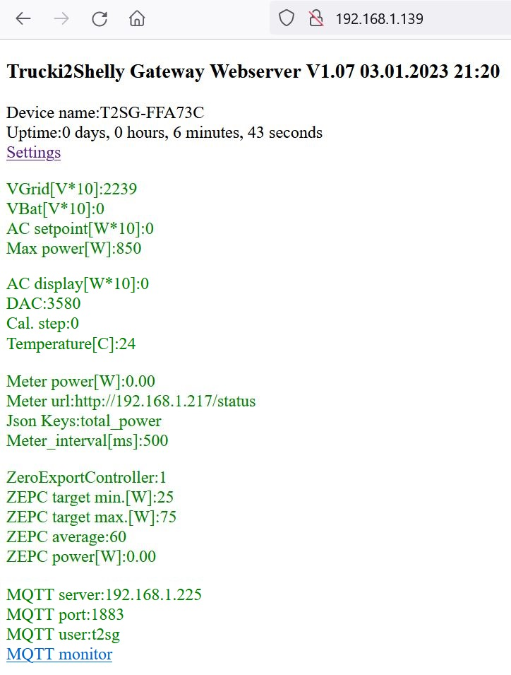

Settings
--------

The settings page allows you to configure the following parameters:

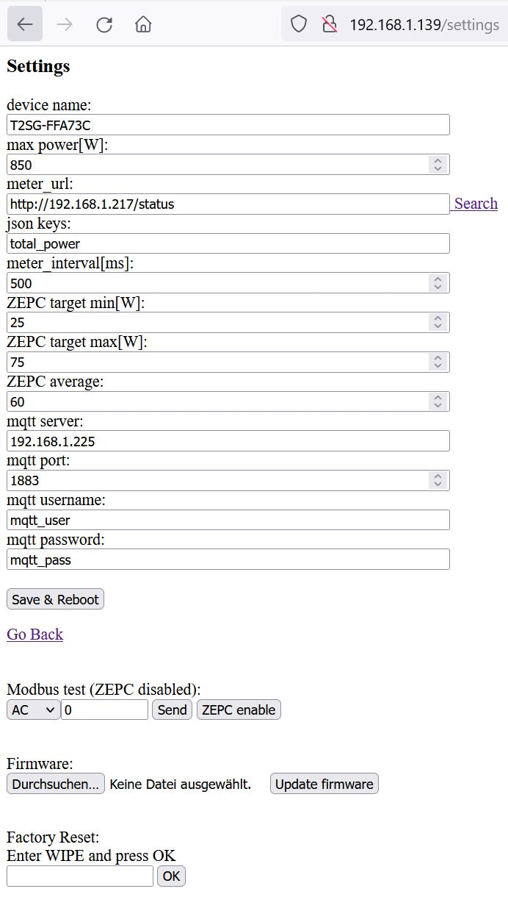

device name:

(default: T2SGxxxxxx - last digits of the wifi mac address) 

To open the webinterface you can call http://devicename.local as well. Furthermore the devicename is the leading part of the mqtt topics.  

max power[W]:

(default: 850) maximum inverter power. Use max. 850/1850W for SUN 1000 / 2000 . Please be aware that this is not a super save protected function. Your hardware installation (i.e. cables, etc.) should be strong enough to deliver the maximum inverter power. Unfortunately the power limit in the menu of the inverter doesn't function if the analog limiter input is used. 

meter_url: 

(default: http://192.168.1.217/status  for Shelly 3EM) ; url where the T2SG can find a json structure with the current grid power. 

| Meter             |      URL                                                     |
|-------------------|--------------------------------------------------------------|
| Shelly 1PM        | http://ip-address/status                                     |
| Shelly 3EM        | http://ip-address/status                                     |
| ShellyPro 3EM     | http://ip-address/rpc/Shelly.GetStatus (Shelly 0.13.0-beta3) |
| Tasmota           | http://ip-address/cm?cmnd=status%2010                        |
| Iammeter WEM3080  | http://ip-address/monitorjson                                |
| Iammeter WEM3080T | http://ip-address/monitorjson                                |


You can use "Search" to search for known engery meters in your network:

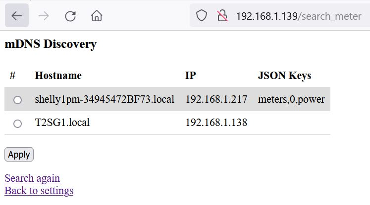

If your meter was found select it and press "Apply" to copy IP and Json keys to the settings page. 

json keys:

(default: total_power  for Shelly 3EM) ; json key for grid power in the received json structure.
| Meter             |      Jsons keys                               |
|-------------------|-----------------------------------------------|
| Shelly 1PM        | meters,0,power                                |
| Shelly 3EM        | total_power                                   |
| ShellyPro 3EM     | em:0,total_act_power   (Shelly 0.13.0-beta3)  |
| Tasmota           | StatusSNS, ... depends on your tasmota config |
| Iammeter WEM3080  | Data,2                                        |
| Iammeter WEM3080T | Datas,3,2                                     |
 
meter intervall[ms]:

(default: 500) grid power will be captured via http request from the engery meter_url every x ms.
   
ZEPC target min[W]:

(default 25) The ZeroExportController keeps the inverter output power stable if the total power of the engery meter is between target_min/max. If the total power is not in this range the ZEPC will increase/decrease the inverter power.

ZEPC target max[W]:

(default 75) see ZEPC target min
   
ZEPC average:

(default 60) ZeroExportController calculates inverter power over average=60 engery meter values. If 
the total power of the engery meter is lower that zepc target min a new value is calculated instandly. For a more aggressive controller setup choose: min:10, max:30, avg:10 .
   
mqtt server: 

(default: 192.168.1.225) mqtt broker ip
 All mqtt settings are optional. Mqtt is used for i.e. data logging. You can use mqtt to send data to a homeserver like ioBroker, nodeRead or HomeAssistant.

mqtt port: 

(default: 1883) mqtt broker port

mqtt username: 

(default: mqtt_user)

mqtt password: 

(default: mqtt_pass)

MQTT monitor:
-------------
Click on "MQTT monitor" on the main page to get a status of the actual received and send mqtt topics:

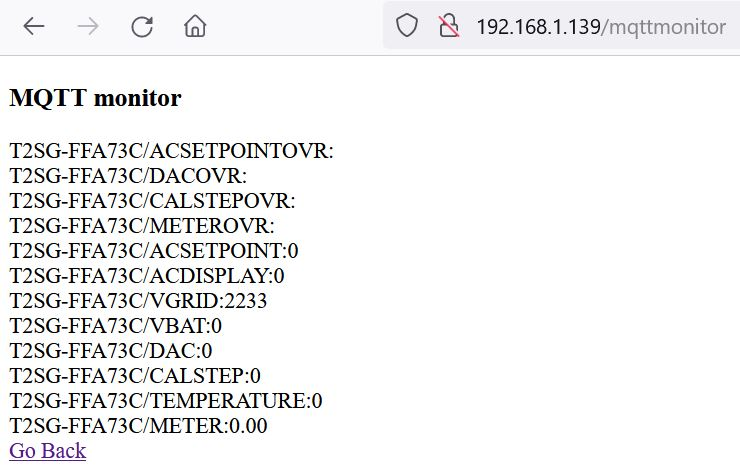

MQTT client publish (read only)
-------------------------------
!!! The mqtt topics (case sensitive) have changed from V1.05 -> V1.07 !!!

The mqtt client publishes every 1.3s the following topics (V1.07): 
```
T2SG/ACSETPOINT
T2SG/ACDISPLAY [W]
T2SG/VGRID [V]
T2SG/VBAT [V]
T2SG/DAC
T2SG/CALSTEP
T2SG/TEMPERATURE [°C]
T2SG/METER [W]
```
T2SG stands for the device name which can be changed in the settings. MQTT Name and topics are case sensitive. If you have several T2SG's make sure that each T2SG has its own name.
  
MQTT client subscribe (write only)
---------------------------------- 
By writing to the mqtt topics: 
```
T2SG/ACSETPOINTOVR
T2SG/CALSTEPOVR [1:start calib., 99:default LUT]
T2SG/DACOVR [0-65535]
T2SG/METEROVR
```
override meter value [W] (uint16). I.e. to simulate external grid power to ZeroExport Controller (meter_url musst be empty)

override ac_setpoint in [W] (int)(ZeroExportController disabled)  

You can overwrite the current values. The ZeroExportController will be disabled if you set the inverter output by writing values to ACSETPOINTOVR. 
Re-enable the ZEPC by:
- writing something to T2SG/METEROVR or,
- click "ZEPC enable" button in settings or,
- rebooting the WEMOS module

T2SG/METEROVR can be used to feed the ZeroExportController instead of the http meter_url readout of the engery meter.
Please make sure that the meter_url ist blank. Otherwise you will have two devices (http readout of meter_url and MQTT) trying to feed the ZeroExportController. 

! Always make sure that your meter is connected between grid and inverter! Otherwise the T2SG will miss the feedback of the inverter output in the meter signal and will just ramp up the output power to maximum!

If you just want to control the output power of the inverter use ACSETPOINTOVR.

HomeAssistant mqtt read/write
-----------------------------
there are better websites to learn how to connect HomeAssistant with a mqtt device.
Just two screenshots. To get this page in HomeAssistant:
  
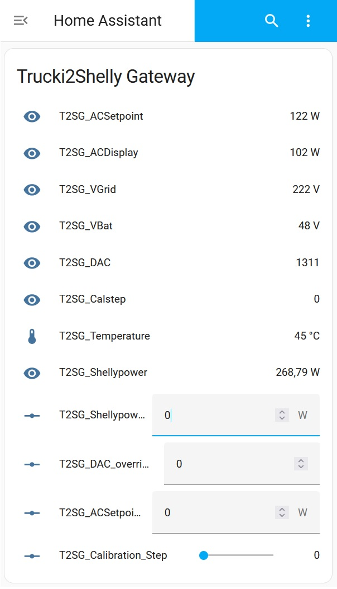

you will have to add a configuation like this to your configuration.yaml:
 


MODBUS Test
-----------
The modbus test at the bottom of the settings page has three options (AC, DAC, CAL):

AC: 

range 0-1850 [W], can be used to set inverters output power by hand. ZEPC will be disabled. Use "ZEPC enable" button to re-enable.  

DAC:

range 0-65535 = 0-3.3V, can be used to set the RT1 two pin analog output signal of the RS485 interface pcb. 

CAL:

can be used to write the CAL Modbus register of the RS485 interface pcb.  Send value=1 to start a calibration and value=99 to reload the default calibration.

A calibration of a the RS485 interface pcb is only necessary if the difference between AC_Setpoint and AC_Display is more than ~15%. Make sure that your DC Source (i.e. battery) has enough power to power your inverter for at least 1min at maximum power. 

Firmware Update
---------------

starting with T2SG V1.07 you can update the T2SG firmware by uploading a new *.bin file to the settings page.

Factory Reset:
--------------
If you want to reset the WIFI/IP configuration you can either goto the settings page and enter "WIPE" into the Factory reset field and press the "OK" button next to it.

Or connect & hold D0 to D5 (i.e. with a screwdriver) and press the reset button on your WEMOS module for ~500ms. 
  
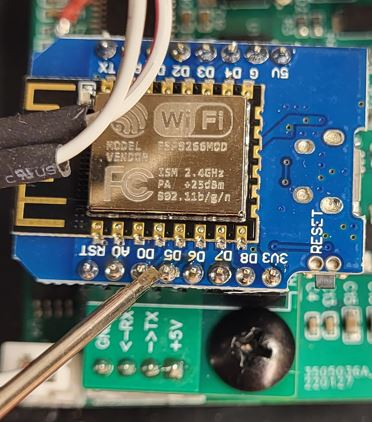
  
The blue LED will be constant ON if the factory/config reset was successful and you will see the T2SGxxxxxx accesspoint again. 


Tasmota instead Shelly
-----------------------
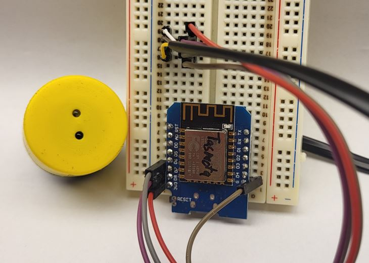
    
Tasmota's SML scripting tool is very powerful and supports many smartmeters (IR,Modbus,...)
  
https://tasmota.github.io/docs/Smart-Meter-Interface/#meter-definition
  
By changing shelly_url and json_keys of the Trucki2Shelly Gateway you can import Tasmota 
grid power (shelly_power) for the ZeroExportController from your Tasmota. 
The shelly_url for your Tasmota should look like this:
  
http://ip-address/cm?cmnd=status%2010 . 
  
The json_keys are dependend on your Tasmota script configuration. 
The first json key is StatusSNS . If your Tasmota SML script i.e. looks like this:
```
>D
>B
=>sensor53 r
tper=20
>M 1
+1,13,o,0,300,SML,15,32,2F3F210D0A,063030300D0A
1,1.8.1*00(@1),Power_curr,W,Power_curr,2
```
Your second json_key is SML and your third json_key is Power_curr .
So, on the Trucki2Shelly Configuration page you have to enter for the
json_keys: StatusSNS,SML,Power_curr    
 
Serial debug interface
----------------------
If you open a Termianl monitor with 9600baud, 8N1 you will get debug information during the
start.

Connect your WEMOS module via USB to your Windows computer and open your Windows Device Manager 
to find out the COM-Port number. You might need to install additional USB Drivers for the CP2104
USB Bridge of the WEMOS module (https://www.silabs.com/developers/usb-to-uart-bridge-vcp-drivers?tab=downloads)

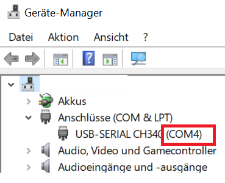

Download, install and start i.e. Putty from https://putty.org .
Select "Serial" as connection type and correct the COM-Port number:

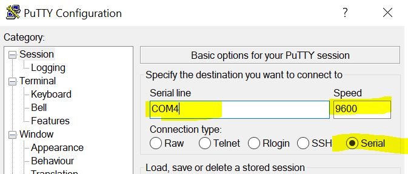

Press "OPEN" and RESET your WEMOS module. You'll get the Debug output of your module:

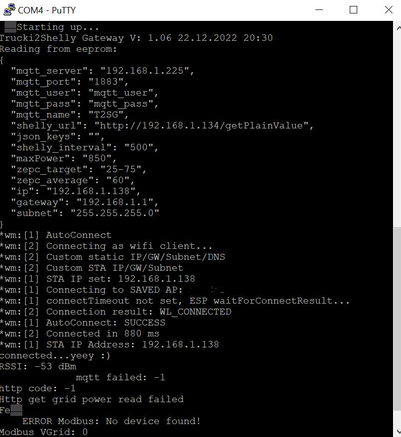
   

Compiling
---------
You don't need to compile this code. Just download the bin file from the bin folder of this project and flash it to your ESP8266 WEMOS module.
If you want to compile it anyway the source code of V1.03 is here: https://github.com/trucki-eu/Trucki2Shelly-Gateway/archive/refs/tags/T2SG_V1.05.zip
I used the standard Arduino IDE 1.8.13 with ESP SDK3.0.2 to compile this code. Generic ESP8266, Flash Size 1MB (FS:64KB, OTA:~470KB) .
