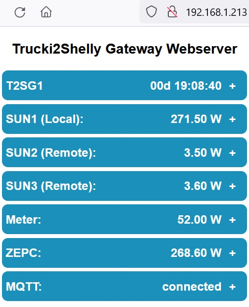
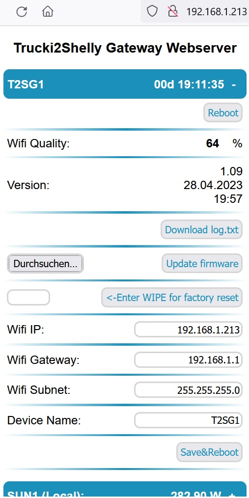
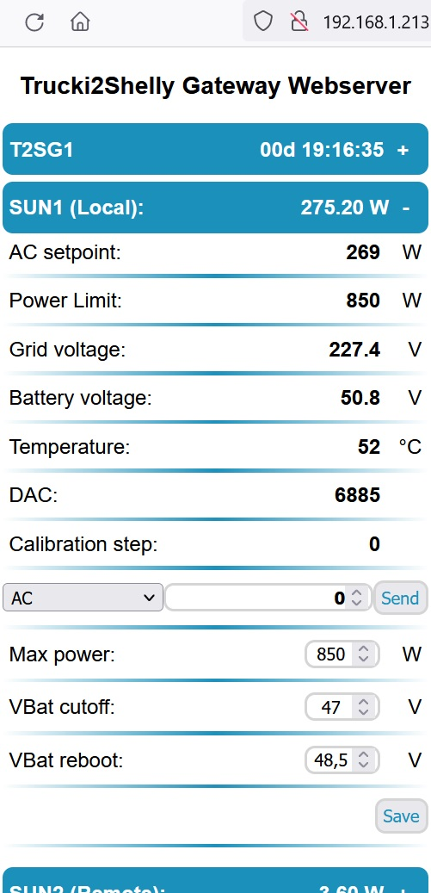
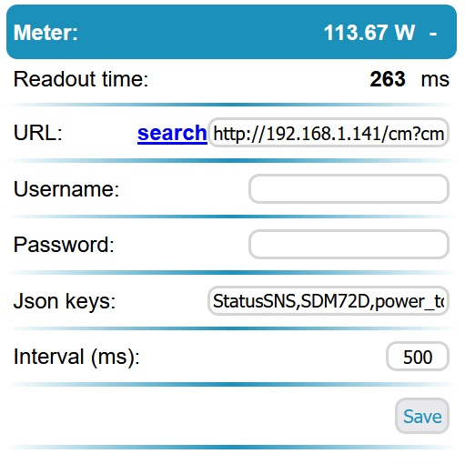
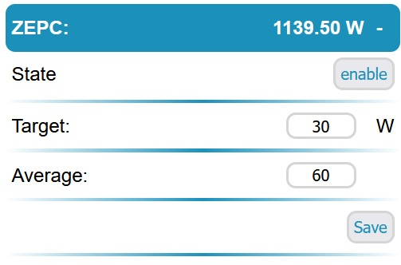
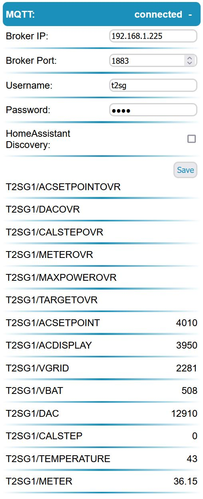
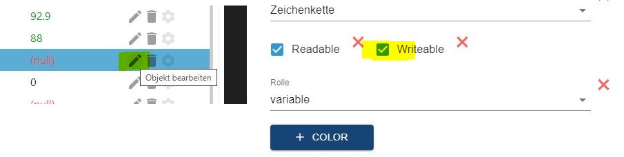

Trucki2Shelly/Tasmota/MQTT Gateway (T2SG) V1.12
-----------------------------------------------

  
The Trucki2Shelly Gateway reads your house power consumption from an engery meter (i.e. Shelly 3EM) and limits the power output of your SUN-GTIL2-600/1000/2000 solar inverter to your actual house consumption.

Besides an energy meter and the SUN inverter you will need one of the following components: 
- Trucki's RS485 interface pcb & Wifi module (i.e WEMOS D1 mini Pro )

https://github.com/trucki-eu/RS485-Interface-for-Sun-GTIL2-1000  

If you want to buy my interface you can write my an email: RS485(a)trucki(point)eu

- Or T2SG Stick (only for Lumentree with feat. Trucki Firmware!)
 
https://www.amazon.de/dp/B0BW4BDXGS

https://www.amazon.de/dp/B0BVQW2M56 


The Trucki2ShellyGateway(T2SG) filters the received total power of the engery meter (ZeroExportController) before it is send to the inverter. The goal of the ZeroExportController (ZEPC) is to keep the total power at ~30W (target). The inverter power rises slowly over ~30s (average*interval) and drops fast (~1s). 

Installation
-------------

RS485 pcb:

Please follow the documentation of the RS485 interface to install it in your inverter:

https://github.com/trucki-eu/RS485-Interface-for-Sun-GTIL2-1000#rs485-modbus-interface-for-sun-gtil2-10002000-mppt-inverter

Make sure J1-J5 (ID:1) are open and the switch (J5) is shifted to UART. If you have a 2000W inverter close the 2000W Jumper on the RS485 interface.

T2SG Stick:

Use this german video for help: 

https://www.youtube.com/watch?v=nXivmhSAXSI

Flashing WEMOS D1 mini pro
--------------------------
Before installing the WEMOS D1 mini pro you should flash the latest *.bin(.gz) file to it:

https://github.com/trucki-eu/Trucki2Shelly-Gateway/blob/main/bin/

 I use "ESP.Easy.Flasher.exe" :
  
https://github.com/Grovkillen/ESP_Easy_Flasher/releases
  
Before starting ESP Easy Flasher you have to copy the bin-file into the /bin folder. After starting select USB Port, bin-file and baudrate = 115200, press flash. After a reset you can begin with the SETUP.
  


As alternative flash programs you can use:
https://github.com/nodemcu/nodemcu-flasher

Or the Espressif ESPTool:
https://github.com/espressif/esptool/releases
```
esptool.exe --chip esp8266 --port COM4 --baud 115200 --before default_reset --connect-attempts 0 --after hard_reset write_flash 0x0 Trucki2Shelly_Gateway_V1.12.esp8285.bin.gz
```

If flashing was successful the blue led on the WEMOS board turns on constant and you will find a wifi accesspoint named: T2SGxxxxxx . 

Now you can proceed directly with SETUP or first install the WEMOS board with the WEMOS adapter into your inverter.

RS485 pcb Wifi module:
----------------------

The lastest revision (V.31.01.2023) of the RS485 pcb has an onboard WEMOS socket. The WEMOS D1 mini pro can be mounted on the RS485 pcb. Make sure to set switch J5 to UART. The WEMOS socket includes a 22uF capacitor on the +3.3V Pin to GND. There is no need for an extra capacitor on the WEMOS board anymore. If your WEMOS D1 mini pro board has a diode between +5V and VUSB you still should bridge it to connect VUSB direct to +5V. Make sure that the 0-ohm resistor next to the antenna connector has the right orientation to use the external antenna.


There are versions of the WEMOS D1 mini Pro which have a diode between VCC_USB and +5V. If your WEMOS only works with USB Power you might want to bridge this diode. The other versions are using a fuse instead of the diode. 


Setup
-----
After the first start (~30s) you will find an open accesspoint named:"T2SGxxxxxx".

Connect to it and open http://192.168.4.1 in your browser:


Select Configure Wifi and set your wifi credentials. Blanks in the SSID are not allowed!

The T2SG now supports DHCP. Just leave static IP, Gateway ans Subnet blank for DHCP or enter values if you want to use a static IP. 

Just above the SAVE button you find the mDNS address of your T2SG (http://T2SGxxxxxx.local). Once your T2SG is connected to your Wifi network you can enter this url into your browser to access the T2SG webinterface. So now it's time to write down the url of your T2SG.  

Further settings will be done in the T2SG webinterface once it is successfully connected to your wifi network.


Blue / orange  LED
------------------
The blue/orange LED flashes every ~1s if successfully connected to your wifi. If the T2SG is not configured (Accesspoint "T2SGxxxxxx" is active) the LED is constant ON.

Webinterface
------------
Once your WEMOS module is connected to your wifi network you can open the configured IP address in your browser to access the T2SG webserver. Instead of the IP adress you can use the devicename followed by ".local" as well. I.e. http://T2SGxxxxxx.local .



Settings
--------
By opening the menu points Device, Sun1-3, Meter, ZEPC (Zero Export Controller) and MQTT you can configure the following settings:

**Device settings:**




***Wifi RSSI at boot:***


Wifi link quality measured at boot in [0-100%].

***Version:***

Trucki2Shelly Gateway Version

Download boot log.txt
download logfile saved during boot

***WIPE/Factory reset:***

Enter WIPE and press "Enter WIPE for factory reset" button to reset all settings to default and delete the wifi configuration. The module will restart in accesspoint mode.

***Update firmware***

press browse to select the new firmware file in *.bin.gz format. As the format of the settings might change it will be necessary to do a factory reset (see below) after the update. If you get the Error: "Not enough space" you uploaded a .bin file. Try to compress the file with GZIP and upload it as *.bin.gz. 

***Wifi IP, Gateway, Subnet, DNS:***

If you want to use a static IP enter the IP, your Gateway, Subnet, DNS and press Save&Reboot. Use Gateway IP for DNS if you don't know what DNS is for. If you want to use DHCP leave all four fields blank.

***NTP, Timezone, NTP Time:***

(Default NTP Server) pool.ntp.org . 

(Default posix timezone for Germany) CET-1CEST,M3.5.0/02,M10.5.0/03

You can find other timezones at: https://github.com/nayarsystems/posix_tz_db/blob/master/zones.json

The NTP Time is used for the night settings in the inverter menu.

***devicename:***

(default: T2SGxxxxxx - last digits of the wifi mac address) 

To open the webinterface you can call http://devicename.local as well. Furthermore the devicename is the leading part of the mqtt topics.  

**Inverter status & settings:**



The SUN1 (Local) page shows the status of the inverter and allows the following settings:

***Power Limit[W]:***

The power limit is the maximum available power the inverter can do calulated by the T2SG. The calculation uses the maxPower value (see below), the temperature (reduce power if temperature > 60°C) and the battery voltage (powerlimit = vbat * 33A). It is calculated internaly and can not be changed.

***MODBUS Test:***

The modbus test allows you to send modbus commands to the inverter. It has three options (AC, DAC, CAL):

AC (reg=0): 

range 0-1850 [W], can be used to set inverters output power by hand. ZEPC will be disabled. Use "ZEPC enable" button to re-enable.  

DAC (reg=4):

range 0-65535 = 0-3.3V, can be used to set the RT1 two pin analog output signal of the RS485 interface pcb. 

CAL (reg=5):

can be used to write the CAL Modbus register of the RS485 interface pcb. Send value=1 to start a calibration and value=99 to reload the default calibration.

A calibration of a the RS485 interface pcb is only necessary if the difference between AC_Setpoint and AC_Display is more than ~15%. Make sure that your DC Source (i.e. battery) has enough power to power your inverter for at least 1min at maximum power. 

With CURL you can send modbus commands from remote:
```
curl "http://IP-Adress/?modbus_reg=0&modbus_value=0" > NULL
```  

***max power[W]:***

(default: 850) maximum inverter power. Make sure that your inverter current does not exceed 33A. The maximum power for 48V is: 48V *33A = 1584W .

The temperature of your inverter should be below 60°C . If it is higher reduce the current into the inverter by i.e. increasing the battery voltage or by reducing the maximum power. 

! Please be aware that maxPower is not a super save protected function ! 

A software bug is always possible. Your hardware installation (i.e. cables, fuse, etc.) should be strong enough to deliver the maximum inverter power. The power limit in the menu of the inverter doesn't function if the analog limiter input is used. 

With CURL & MQTT (see below) you can change the maxPower temporary from remote:
```
curl "http://192.168.1.213/?maxPower=850" > NULL
```  

***vbat cutoff[V]:***

Sun1 AC Setpoint will be set to 0W if your battery voltage is below VbatCutoff. 

With CURL you can change the vbatcutoff temporary from remote:
```
curl "http://192.168.1.213/?vbatCutoff=47.1" > NULL
```  

***vbat reboot[V]:***

Battery restart voltage after a detected VBatcutoff 

With CURL you can change the vbatcutoff temporary from remote:
```
curl "http://192.168.1.213/?vbatReboot=48.5" > NULL
``` 
***night starts/ends at:***

Start/Stop time HH:MM for night mode

***maxPower at night:***

Maximum inverter power in night mode

**SUN2-3 (Remote):**

You can add up to two other T2SG to your first T2SG just by adding the IP Adress of your 2nd and 3rd T2SG.

The ZEPC will add the next SUN if the power limit of the previous SUN is used for 75%. It will be disabled again if its power drops below 50% of its power limit.  

Do not enter a Meter url in the webinterface of the 2nd and 3rd SUN. The ZEPC of the 2nd, 3rd SUN will show LINKED if it is connected to the T2SG of the first SUN.

The roundtrip shows the communication time between the local and the remote sun.


 

**Meter settings:**




***meter_url:*** 

(default: http://192.168.1.217/status  for Shelly 3EM) ; url where the T2SG can find a json structure with the current grid power. The following table shows meter_urls for tested meters:

| Meter             |      URL                                                     |
|-------------------|--------------------------------------------------------------|
| Shelly 1PM        | http://ip-address/status                                     |
| Shelly EM         | http://ip-address/status                                     |
| Shelly 3EM        | http://ip-address/status                                     |
| ShellyPro 3EM     | http://ip-address/rpc/Shelly.GetStatus (Shelly 0.13.0-beta3) |
| Tasmota           | http://ip-address/cm?cmnd=status%2010                        |
| Iammeter WEM3080  | http://ip-address/monitorjson                                |
| Iammeter WEM3080T | http://ip-address/monitorjson                                |
| Powerfox Poweropti | http://ip-address/rpc  (intervall max. 500ms) (!see note!)  |
Note: Powerfox can not used with T2SG anymore. With version 2.01.27 Powerfox closed the local readout.  

You can use "Search" to search for known engery meters in your network:


If your meter was found select it and press "Apply" to copy IP and Json keys to the settings page. 

***json keys:***

(default: total_power  for Shelly 3EM) ; json key for grid power in the received json structure.
| Meter             |      Jsons keys                               |
|-------------------|-----------------------------------------------|
| Shelly 1PM        | meters,0,power                                |
| Shelly EM         | emeters,0,power                               |
| Shelly 3EM        | total_power                                   |
| ShellyPro 3EM     | em:0,total_act_power   (Shelly 0.13.0-beta3)  |
| Tasmota           | StatusSNS, ... depends on your tasmota config |
| Iammeter WEM3080  | Data,2                                        |
| Iammeter WEM3080T | Datas,3,2                                     |
| Powerfox Poweropti | result  (intervall max. 500ms) (!see note!)  |
Note: Powerfox can not used with T2SG anymore. With version 2.01.27 Powerfox closed the local readout.

***meter intervall[ms]:***

(default: 500) grid power will be captured via http request from the engery meter_url every x ms.

***meter readout invert:***

(default: OFF) OFF means: positiv meter value = house consumption. Negativ meter value means power export to the grid. ON: inverts this logic.

**ZEPC (Zero Export Controller) settings:**



***ZEPC target [W]:***

(default 30) The ZeroExportController keeps the inverter output power stable if the total power of the meter is between target_min/max. If the total power is not in this range the ZEPC will increase/decrease the inverter power.

With CURL & MQTT (see below) you can change the zepc target temporary from remote:
```
curl "http://192.168.1.213/?zepc_target=29" > NULL
```  

***ZEPC average:***

(default 30) ZeroExportController calculates inverter power over average=30 meter values. If 
the total power of the meter is lower than zepc target a new value is calculated instandly. For a more aggressive controller setup choose: target:30, avg:10 .

***use display feedback:***

(default: OFF) ZeroExportController needs to know the current power of each inverter. OFF: The setpoints of the inverters are used for the ZEPC. ON: the display value of each inverter is used. As the display has ~1s delay the ZEPC is less accurate. Use this option if you are using solar panels on the DC input instead of a battery.

**MQTT status & settings:**




***broker ip:*** 

(default: 192.168.1.225) mqtt broker ip
 All mqtt settings are optional. Mqtt is used for i.e. data logging. You can use mqtt to send data to a homeserver like ioBroker, nodeRead or HomeAssistant.

***broker port:*** 

(default: 1883) mqtt broker port

***username:***

(default: mqtt_user)

***password:*** 

(default: mqtt_pass)

***HomeAssistant Discovery:*** 

By enabling this checkbox the T2SG will send discovery information to HomeAssistant. If the MQTT Broker of your HomeAssistant is properly configured you will find the T2SG device as Entity in HomeAssistant. The *OVR numbers might not be discovery. At the moment I don't know why.

(default: disabled)

***MQTT monitor:***

Below the Save&Reboot button you will find the sent and received mqtt topics and values. 


MQTT client publish (read only)
-------------------------------
!!! The mqtt topics (case sensitive) have changed from V1.05 -> V1.07 !!!

The mqtt client publishes every 1.3s the following topics: 
```
T2SG/ACSETPOINT
T2SG/ACDISPLAY [W]
T2SG/VGRID [V]
T2SG/VBAT [V]
T2SG/DAC
T2SG/CALSTEP
T2SG/TEMPERATURE [°C]
T2SG/METER [W]
```
T2SG stands for the device name which can be changed in the settings. MQTT Name and topics are case sensitive. If you have several T2SG's make sure that each T2SG has its own name.
  
MQTT client subscribe (write only)
---------------------------------- 
By writing to the mqtt topics: 
```
T2SG/ACSETPOINTOVR
T2SG/CALSTEPOVR [1:start calib., 99:default LUT]
T2SG/DACOVR [0-65535]
T2SG/METEROVR
T2SG/MAXPOWEROVR
T2SG/TARGETOVR
```
override meter value [W] (uint16). I.e. to simulate external grid power to ZeroExport Controller (meter_url musst be empty)

override ac_setpoint in [W] (int)(ZeroExportController disabled)  

You can overwrite the current values. The ZeroExportController will be disabled if you set the inverter output by writing values to ACSETPOINTOVR. 
Re-enable the ZEPC by:
- writing something to T2SG/METEROVR or,
- click "ZEPC enable" button in settings or,
- rebooting the WEMOS module

T2SG/METEROVR can be used to feed the ZeroExportController instead of the http meter_url readout of the engery meter.
Please make sure that the meter_url ist blank. Otherwise you will have two devices (http readout of meter_url and MQTT) trying to feed the ZeroExportController. 

! Always make sure that your meter is connected between grid and inverter! Otherwise the T2SG will miss the feedback of the inverter output in the meter signal and will just ramp up the output power to maximum!

If you just want to control the output power of the inverter use ACSETPOINTOVR.

! OVR stands for OVERWRITE ! Means if you OVERWRITE the maxPower value with MAXPOWEROVR=0 from your MQTT broker your T2SG will not work anymore. If you don't want to overwrite the maxpower from your MQTT broker disable the value in your broker. I.e.: 



HomeAssistant mqtt read/write
-----------------------------
there are better websites to learn how to connect HomeAssistant with a mqtt device.
Just two screenshots. To get this page in HomeAssistant:
  


you will have to add a configuation like this to your configuration.yaml:
 


Factory Reset:
--------------
If you want to reset the WIFI/IP configuration you can either goto the settings page and enter "WIPE" into the Factory reset field and press the "OK" button next to it.

The routine for a hardware factory reset has changed wiht V1.09:

For the T2SG Stick just press the reset button for about 5s through the small hole under the LED. The LED will blink fast if the reset was successful.

For the Wifi Module connect D0 to D5 (i.e. with a screwdriver) for about 5s. The LED will blink fast if the reset was successful.

  


After the factory reset the LED will be constant ON and you will see the T2SGxxxxxx accesspoint again. 


Tasmota instead Shelly
-----------------------

    
Tasmota's SML scripting tool is very powerful and supports many smartmeters (IR,Modbus,...)
  
https://tasmota.github.io/docs/Smart-Meter-Interface/#meter-definition
  
By changing shelly_url and json_keys of the Trucki2Shelly Gateway you can import Tasmota 
grid power (shelly_power) for the ZeroExportController from your Tasmota. 
The shelly_url for your Tasmota should look like this:
  
http://ip-address/cm?cmnd=status%2010 . 
  
The json_keys are dependend on your Tasmota script configuration. 
The first json key is StatusSNS . If your Tasmota SML script i.e. looks like this:
```
>D
>B
=>sensor53 r
tper=20
>M 1
+1,13,o,0,300,SML,15,32,2F3F210D0A,063030300D0A
1,1.8.1*00(@1),Power_curr,W,Power_curr,2
```
Your second json_key is SML and your third json_key is Power_curr .
So, on the Trucki2Shelly Configuration page you have to enter for the
json_keys: StatusSNS,SML,Power_curr    
 
Serial debug interface
----------------------
If you open a Termianl monitor with 9600baud, 8N1 you will get debug information during the
start.

Connect your WEMOS module via USB to your Windows computer and open your Windows Device Manager 
to find out the COM-Port number. You might need to install additional USB Drivers for the CP2104
USB Bridge of the WEMOS module https://www.silabs.com/developers/usb-to-uart-bridge-vcp-drivers?tab=downloads

For TruMos Wifi modules you will need the CH340 USB Driver which you can download as zip file here. Just click on the cloud icon at the middle of the page:
https://www.wch.cn/download/CH341SER_ZIP.html


Download, install and start i.e. Putty from https://putty.org .
Select "Serial" as connection type and correct the COM-Port number:


Press "OPEN" and RESET your WEMOS module. You'll get the Debug output of your module:


   

Compiling
---------
You don't need to compile this code. Just download the bin file from the bin folder of this project and flash it to your ESP8266 WEMOS module.
If you want to compile it anyway the source code of V1.03 is here: https://github.com/trucki-eu/Trucki2Shelly-Gateway/archive/refs/tags/T2SG_V1.05.zip
I used the standard Arduino IDE 1.8.13 with ESP SDK3.0.2 to compile this code. Generic ESP8266, Flash Size 1MB (FS:64KB, OTA:~470KB) .

License and credits
--------------------
Shield: [![CC BY-NC-SA 4.0][cc-by-nc-sa-shield]][cc-by-nc-sa]

The T2SG project is published under
[Creative Commons Namensnennung-Nicht kommerziell-Share Alike 4.0 International-Lizenz][cc-by-nc-sa].

[![CC BY-NC-SA 4.0][cc-by-nc-sa-image]][cc-by-nc-sa]

[cc-by-nc-sa]: http://creativecommons.org/licenses/by-nc-sa/4.0/deed.de
[cc-by-nc-sa-image]: https://licensebuttons.net/l/by-nc-sa/4.0/88x31.png
[cc-by-nc-sa-shield]: https://img.shields.io/badge/License-CC%20BY--NC--SA%204.0-lightgrey.svg

The project uses the following libraries:

|Name               |URL                                                                                       |License|
|-------------------|------------------------------------------------------------------------------------------|-------|
| ArduinoJson	 	| https://github.com/bblanchon/ArduinoJson/blob/6.x/LICENSE.txt 		                   |MIT    | 
| StreamUtils	 	| https://github.com/bblanchon/ArduinoStreamUtils/blob/master/LICENSE.md               	   |MIT    | 
| ESP8266 core 		| https://github.com/esp8266/Arduino#license-and-credits 		                           |LGPL   | 
| LittleFS 		    | https://github.com/littlefs-project/littlefs/blob/master/LICENSE.md 		               |BSD 3  | 
| WiFiManager	 	| https://github.com/tzapu/WiFiManager/blob/master/LICENSE 			                       |MIT    | 
| ArduinoMqttClient | https://github.com/arduino-libraries/ArduinoMqttClient/blob/master/LICENSE.txt           |GNUV2.1|
| uptime_formatter 	| https://github.com/YiannisBourkelis/Uptime-Library/blob/master/LICENSE                   |GNUV3  |
| ESPAsyncWebServer | https://github.com/me-no-dev/ESPAsyncWebServer/blob/master/src/ESPAsyncWebServer.h#L7-L19|GNUV2.1|
| ESPAsyncTCP       | https://github.com/me-no-dev/ESPAsyncTCP/blob/master/LICENSE.txt                         |GNUV3  |

I thank the authors for making my code life easyer by sharing there libaries.
